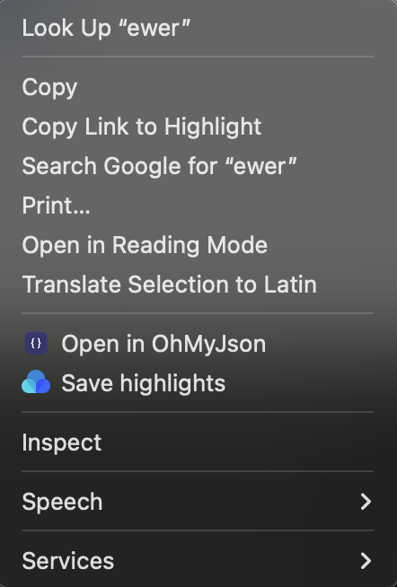

<p align="center">
  
  <h1 align="center">OhMyJson</h1>
  <p align="center">A lightning-fast JSON viewer that lives in your menu bar.<br>Press a hotkey, and your clipboard JSON is instantly formatted.</p>
</p>

<p align="center">
  
  
  
</p>

<p align="center">
  
</p>

## Installation

### Homebrew

```bash
brew tap vagabond95/ohmyjson
brew install --cask ohmyjson
```

### Download

Download the latest `.dmg` from [GitHub Releases](https://github.com/vagabond95/OhMyJson/releases), open the disk image, and drag **OhMyJson.app** to `/Applications`.

OhMyJson is signed and notarized with Apple Developer ID — no Gatekeeper warnings.


## Chrome Extension

**[OhMyJson for Chrome](https://chromewebstore.google.com/detail/ohmyjson-open-in-json-vie/bmfbdagmfcaibmpngdkpdendfonpepde)** brings OhMyJson into your browser.

Select any JSON text on a chrome → right-click → **Open in OhMyJson**.  — just instant viewing.




## Permissions

> Requires **Accessibility** permission for the global hotkey.
> macOS will prompt on first launch, or enable manually: **System Settings → Privacy & Security → Accessibility**.


## Development

```bash
git clone https://github.com/vagabond95/OhMyJson.git
cd OhMyJson
open OhMyJson.xcodeproj
```

Build and run with **⌘R** in Xcode, or from the command line:

```bash
xcodebuild -project OhMyJson.xcodeproj -scheme OhMyJson -configuration Release
```

**Requirements:** Xcode 15+, Swift 5.9+


## Contributing

Found a bug or have a suggestion? [Open an issue](https://github.com/vagabond95/OhMyJson/issues).


## License

[MIT](LICENSE) © vagabond95
