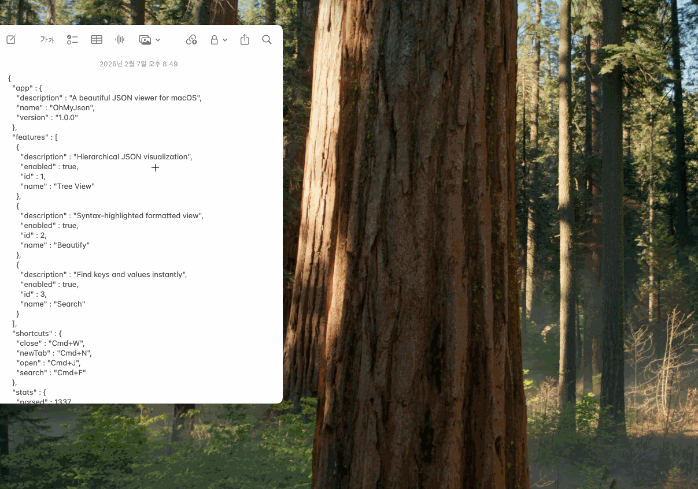

<p align="center">
  <!--  -->
  <h1 align="center">OhMyJson</h1>
  <p align="center">A lightning-fast, hotkey-driven JSON viewer for macOS.</p>
</p>

<p align="center">
  
  
</p>

<p align="center">
  
</p>

## Why OhMyJson?

Formatting JSON is something developers do dozens of times a day — yet most reach for a browser tab every time. OhMyJson lives in your menu bar and parses clipboard JSON the instant you press key. No context switching, no web tools, no friction.

## Features

- **Global Hotkey** — Instantly parse clipboard JSON from anywhere on your Mac
- **Real-time Validation** — Auto-parses as you type with inline error reporting (line & column)
- **Tree View** — Collapsible, syntax-highlighted tree with expand/collapse all (⌘] / ⌘[)
- **Beautified View** — Formatted JSON output with one-click copy
- **Multi-Tab** — Up to 10 tabs with LRU auto-close for older sessions
- **Search** — Find across keys and values with match navigation (⌘F)
- **Dark / Light / System Theme** — Follows your macOS appearance or pick your own
- **Customizable Hotkeys** — Remap the global trigger and clear shortcut
- **Menu Bar Resident** — No Dock icon, always a hotkey away
- **Launch at Login** — Start automatically with your Mac

## Installation

### Download

Download the latest `.dmg` from [GitHub Releases](https://github.com/vagabond95/OhMyJson/releases), open the disk image, and drag **OhMyJson.app** to `/Applications`.

> **Note:** OhMyJson is not notarized (built with a free Apple Developer account), so macOS Gatekeeper will block the first launch. To open it:
>
> 1. Open **System Settings → Privacy & Security**
> 2. Scroll down — you'll see *"OhMyJson was blocked from use because it is not from an identified developer."*
> 3. Click **Open Anyway** and confirm
>
> You only need to do this once.

### Build from Source

```bash
git clone https://github.com/vagabond95/OhMyJson.git
cd OhMyJson
open OhMyJson.xcodeproj
```

Build and run with **⌘R** in Xcode, or from the command line:

```bash
xcodebuild -project OhMyJson.xcodeproj -scheme OhMyJson -configuration Release
```

**Requirements:** Xcode 15+, Swift 5.9+

## Permissions

OhMyJson uses a **global hotkey** to capture ⌘⇧V system-wide. This requires Accessibility permission.

**System Settings → Privacy & Security → Accessibility** → toggle **OhMyJson** on.

macOS will prompt you on first launch. The app cannot intercept the hotkey without this permission.

## Usage

### Basic Workflow

1. Copy any JSON to your clipboard
2. Press **⌘ J** — OhMyJson opens and parses it instantly
3. Explore the tree, search, or copy the formatted output

If the clipboard doesn't contain valid JSON, OhMyJson opens with an empty editor — paste or type JSON directly.

### Keyboard Shortcuts

| Shortcut | Action |
|----------|--------|
| **⌘J** | Open viewer + parse clipboard *(global, customizable)* |
| **⌘N** | New tab |
| **⌘W** | Close tab |
| **⌘⇧[** ,  **⌘⇧]** | Previous / Next tab |
| **⌘F** | Search |
| **⌘1** | Beautified view |
| **⌘2** | Tree view |

## Tech Stack

| | |
|---|---|
| **Language** | Swift 5.9+ |
| **UI** | SwiftUI |
| **Platform** | macOS 13.0+ (Ventura) |
| **Dependencies** | [ConfettiSwiftUI](https://github.com/simibac/ConfettiSwiftUI) |

## Contributing

Found a bug or have a suggestion? [Open an issue](https://github.com/vagabond95/OhMyJson/issues).

## License

[MIT](LICENSE) © vagabond95
