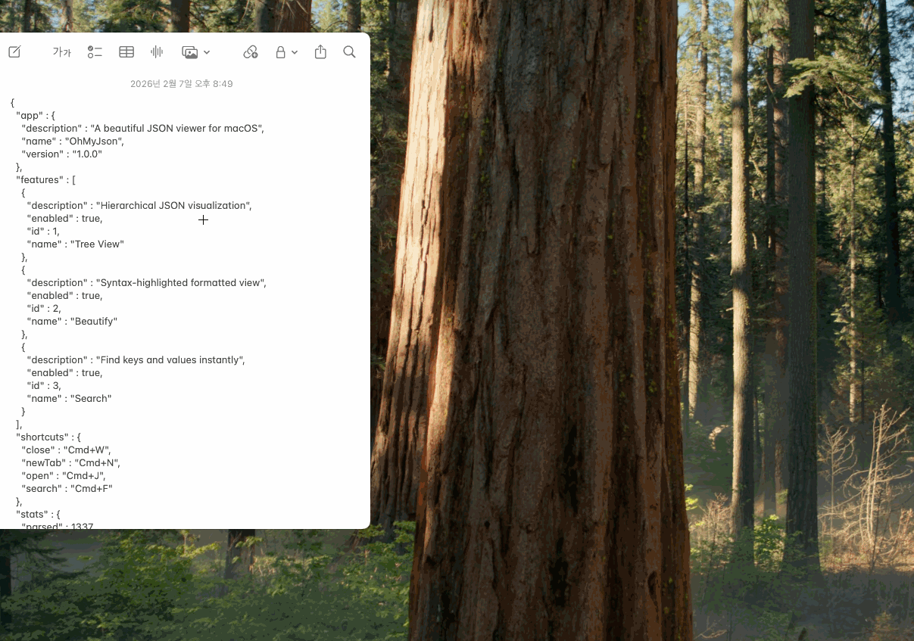
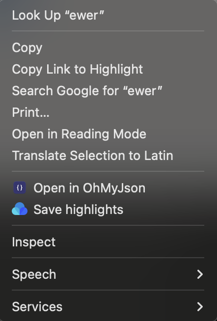

<p align="center">
  
  <h1 align="center">OhMyJson</h1>
  <p align="center">Copy JSON, Press hot key. Done.</p>
</p>

<p align="center">
  
  
  
</p>

<p align="center">
  
</p>

## Features

- **Beautify** — One-click pretty-print with syntax highlighting
- **Tree View** — Collapsible tree to explore deeply nested JSON at a glance
- **Compare** — Side-by-side structural diff of two JSONs with added/removed/modified highlighting
- **Global Hotkey** — Press `Ctrl+Option+J` anywhere to instantly format clipboard JSON
- **Tab Persistence** — Your tabs and contents are saved across app restarts

## Installation

### Homebrew

```bash
brew tap vagabond95/ohmyjson
brew install --cask ohmyjson
```

### Download

Download the latest `.dmg` from [GitHub Releases](https://github.com/vagabond95/OhMyJson/releases), open the disk image, and drag **OhMyJson.app** to `/Applications`.

OhMyJson is signed and notarized with Apple Developer ID — no Gatekeeper warnings.


## Chrome Extension

**[OhMyJson for Chrome](https://chromewebstore.google.com/detail/ohmyjson-open-in-json-vie/bmfbdagmfcaibmpngdkpdendfonpepde)** brings OhMyJson into your browser.

Select any JSON text on a chrome → right-click → **Open in OhMyJson**.  — just instant viewing.




## Contributing

Found a bug or have a suggestion? [Open an issue](https://github.com/vagabond95/OhMyJson/issues).


## License

[MIT](LICENSE) © vagabond95
